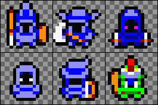
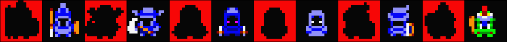
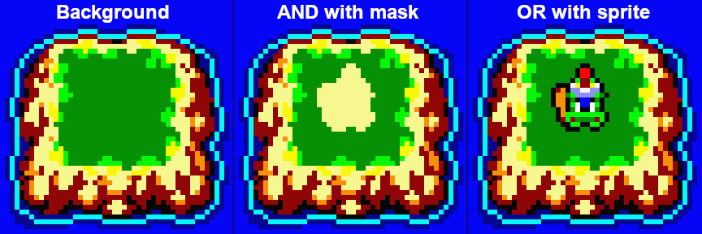

# Graphics Library

**Note: The graphics library is a work in progress; it is not included in the latest stable 1.0 release, but can be found in the source repository.**

While SymbOS provides features (primarily the `C_IMAGE` and `C_IMAGE_EXT` controls) for directly plotting images, the graphics format is internally complicated and depends on the exact platform and screen mode in which the application is running. The SCC graphics library simplifies this process by implementing a set of standard functions for loading and plotting images and sprites and directly manipulating pixels on a canvas.

**Note:** All graphics functions are thread-safe, except that only one canvas may be [active](#initializing_canvases) at a time. However, multiple threads can draw to the same canvas at the same time.

## Using the library

To use the library, include the `graphics.h` header:

```c
#include <graphics.h>
```

Additionally, use the `-lgfx` option when compiling to specify that the executable should be linked with the graphics library `libgfx.a`:

```bash
cc source.c -lgfx
```

## Using canvases

The SCC graphics library provides a set of functions for working with "canvases", bitmapped image buffers that can be displayed in SymbOS windows using the `C_IMAGE_EXT` control. We can plot sprites, draw lines, and directly edit the displayed image in other ways.

### Creating canvases

To create a canvas, first define a `char` buffer with the size `(width * height / 2) + 24`:

```c
_data char canvas[(128*64/2) + 24];
```

Canvas size is limited to 504x255 pixels, and **the width of a canvas in pixels must be a multiple of 8**. To work correctly on all platforms, a single canvas must also stay within a single 16KB memory segment; the easiest way to guarantee this is to place it in either the **data** or **transfer** segment. (This 16KB limit unfortunately means that the maximum *practical* size of a single canvas is much smaller than 504x255: e.g., 180x180, 240x136, 504x64, etc.)

To show this canvas in a window, we can use the `C_IMAGE_EXT` control. Set the `param` argument to point to the address of the canvas, and the `w` and `h` arguments to match the desired pixel width and height of the canvas:

```c
_transfer Ctrl c_canvas =
    {1,                      // control ID
	 C_IMAGE_EXT,            // control type
	 -1,                     // canvas bank (-1 = same as this record)
	 (unsigned short)canvas, // address of canvas
	 10, 10,                 // x, y
	 128, 64};               // w, h
```

If a canvas is greater than 252 pixels in width, we must instead create two `C_IMAGE_EXT` controls to display two halves (left and right) of the same canvas. These controls should be defined as follows:

* The width of the left control should be 252 pixels.
* The width of the right control should be (total width - 252) pixels.
* The `x` position of the right control should be 252 pixels greater than the `x` position of the left control.
* The `param` value of the right control should point to (canvas + 10) rather than (canvas).

For example, for a canvas 304x16 pixels in size:

```c
_transfer Ctrl c_canvas1 = {1, C_IMAGE_EXT, -1, (unsigned short)canvas,      10, 10, 252, 16};
_transfer Ctrl c_canvas2 = {2, C_IMAGE_EXT, -1, (unsigned short)canvas + 10, 10, 10,  52, 16};
```

### Initializing canvases

**Before opening the window in which the canvas is displayed**, we must initialize it with the `Gfx_Init()` function:

```c
void Gfx_Init(char* canvas, unsigned short w, unsigned char h);
```

For example, to initialize the 128x64 pixel canvas defined at the start of this section:

```c
Gfx_Init(canvas, 128, 64);
```

**Before drawing to a canvas**, we must select it as the active canvas using `Gfx_Select()`. If desired, we can maintain multiple canvases and switch which is being drawn to using this function.

```c
void Gfx_Select(char* canvas);
```

For example, to select the canvas defined at the start of this section:

```c
Gfx_Select(canvas);
```

### Refreshing the display

Updating the canvas with a graphics function does not automatically update the screen to display the changes. This means that graphics are automatically double-buffered, reducing flicker, but also that we must manually tell SymbOS to redraw the canvas (which is often the slowest part of the whole process). The simplest method is to redraw the entire canvas by using `Win_Redraw()` system call to redraw its control:

```c
Win_Redraw(winID, 1, 0); // redraw control ID 1 (the canvas's C_IMAGE_EXT control above)
```

However, redrawing a full canvas can visibly take a fraction of a second on a 4 MHz processor, which is nonideal for games with fluid animation. An alternative is to use the `Win_Redraw_Area()` system call to redraw only the part of the canvas that has changed. This is much faster, but requires us to keep track of the coordinates that have changed and issue the correct call:

```c
Win_Redraw_Area(winID, 1, 0, 10, 10, 16, 16); // redraw only the 16x16 pixel region starting at x=10, y=10 in control ID 1
```

**Important**: The coordinates for `Win_Redraw_Area` are relative to the *window content*, not the canvas! This means that, if the canvas is not at position `x` = 0, `y` = 0 in the window, the coordinates passed to `Win_Redraw_Area` must have the canvas position added in.

It is important to understand that refreshes occur asynchronously. We are telling the desktop manager to refresh the control at its earliest convenience, but our code will keep running in the meantime, and there is no way to determine when the refresh has actually occurred (except that, once the screen is refreshed, there will be a delay of at least 20 milliseconds before it can be refreshed again). This is helpful for realtime games, where waiting for a refresh would slow everything down, but can also create subtle traps. In particular, if we are continuously updating the canvas, what is actually shown on the screen will not be the contents of the canvas *at the time the refresh was requested*, but the contents of the canvas some fraction of a second later *when the refresh is actually performed.* Care should therefore be taken not to "get ahead of" the screen refresh by, e.g., plotting a sprite, requesting a refresh, and then immediately moving it somewhere else.

## Drawing functions

### Gfx_Pixel()

```c
void Gfx_Pixel(unsigned short x, unsigned char y, unsigned char color);
```

Plots a single pixel with the color `color` to the pixel coordinates `x`, `y` on the currently active canvas. No bounds-checking is performed, so be sure that the coordinates are actually valid. In 4-color modes, higher colors will be automatically rendered down to 4 colors.

### Gfx_Safe_Pixel()

```c
void Gfx_Safe_Pixel(unsigned short x, unsigned char y, unsigned char color);
```

Equivalent to `Gfx_Pixel()`, but performs a simple bounds check and skips plotting the pixel if the coordinates are invalid for the current canvas. This function should be used instead of `Gfx_Pixel()` in cases where it is not known ahead of time that the pixel coordinates are valid.

### Gfx_Value()

```
unsigned char Gfx_Value(unsigned short x, unsigned char y);
```

Returns the color of the pixel on the active canvas at pixel coordinates `x`, `y`.

### Gfx_Line()

```c
void Gfx_Line(unsigned short x0, unsigned char y0,
              unsigned short x1, unsigned char y1,
			  unsigned char color);
```

Draws a 1-pixel-thick line of color `color` from point `x0`, `y0` to point `x1`, `y1` on the current canvas. No bounds-checking is performed, so be sure that the coordinates are actually valid. In 4-color modes, higher colors will be automatically rendered down to 4 colors.

### Gfx_LineB()

```c
void Gfx_LineB(unsigned short x0, unsigned char y0,
               unsigned short x1, unsigned char y1,
			   unsigned char color, unsigned char bits);
```

Equivalent to `Gfx_Line()`, but only pixels corresponding to bits set in the bitmask `bits` will be drawn (starting from the most significant bit and repeating after 8 bits/pixels). For example, to draw a dashed line (two pixels on + two pixels off, repeating), we could use the bitmask `0xCC`.

### Gfx_HLine()

```c
void Gfx_HLine(unsigned short x, unsigned char y, unsigned short w, unsigned char color);
```

Draws a 1-pixel-thick line horizontal line of color `color` from point `x`, `y` to the point `w` pixels to the right. This is faster than using `Gfx_Line()` for cases where the line is known to be horizontal. No bounds-checking is performed, so be sure that the coordinates are actually valid. In 4-color modes, higher colors will be automatically rendered down to 4 colors.

### Gfx_VLine()

```c
void Gfx_VLine(unsigned short x, unsigned char y, unsigned short h, unsigned char color);
```

Draws a 1-pixel-thick line vertical line of color `color` from point `x`, `y` to the point `h` pixels below. This is faster than using `Gfx_Line()` for cases where the line is known to be vertical. No bounds-checking is performed, so be sure that the coordinates are actually valid. In 4-color modes, higher colors will be automatically rendered down to 4 colors.

### Gfx_Box()

```c
void Gfx_Box(unsigned short x0, unsigned char y0,
             unsigned short x1, unsigned short y1,
			 unsigned char color);
```

Draws an unfilled rectangle of color `color` whose upper left corner is at the pixel coordinates `x0`, `y0` and whose lower right corner is at the pixel coordinates `x1`, `y1`. No bounds-checking is performed, so be sure that the coordinates are actually valid. In 4-color modes, higher colors will be automatically rendered down to 4 colors.

### Gfx_BoxF()

```c
void Gfx_BoxF(unsigned short x0, unsigned char y0,
              unsigned short x1, unsigned short y1,
			  unsigned char color);
```

Draws a filled rectangle of color `color` whose upper left corner is at the pixel coordinates `x0`, `y0` and whose lower right corner is at the pixel coordinates `x1`, `y1`. No bounds-checking is performed, so be sure that the coordinates are actually valid. In 4-color modes, higher colors will be automatically rendered down to 4 colors.

### Gfx_Circle()

```c
void Gfx_Circle(signed short x0, signed short y0, signed short radius, unsigned char color);
```

Draws an unfilled circle with the color `color`, a radius of `radius` pixels, and its centerpoint at `x0`, `y0`. The circle may overlap the edges of the canvas. In 4-color modes, higher colors will be automatically rendered down to 4 colors.

### Gfx_Text()

```c
void Gfx_Text(unsigned short x, unsigned char y, char* text, unsigned char color, char* font);
```

Draws the text string `text` at the pixel coordinates `x`, `y` on the currently active canvas, using color `color` and the font at the address `font`. If `font` = 0, the system font will be used. No clipping is performed, so be sure that the coordinates are actually valid (including that the text will not overflow the right margin).

Drawing text using the system font is a bit slower than using a custom font because of the need for banked memory access. (This is the opposite of how system text controls behave, where using the system font is faster.) Unlike system controls, it does not matter which segment custom font data is stored in. A description of the font format can be found in the SymbOS Developer Documentation; fonts can be created using the SymbOS Font Editor application.

### Gfx_Clear()

```c
void Gfx_Clear(char* canvas, unsigned char color);
```

Clears the entirety of canvas `canvas` to color `color`. In 4-color modes, higher colors will be automatically rendered down to 4 colors. (This is faster than filling the entire canvas using `Gfx_BoxF()`.)

## Sprite functions

We can load images in SGX format from disk and plot them directly on the canvas, or copy portions of the canvas as images for saving to disk or subsequent plotting. Images handled in this way **must have a width that is a multiple of 4 pixels** and cannot exceed 252x255 pixels in width/height. (This means that we cannot load, e.g., complete desktop backgrounds as sprites.)

### Converting images

Images can be converted to SGX format with software such as [MSX Viewer 5](https://marmsx.msxall.com/msxvw/msxvw5/index_en.php) (classic version). The graphics library is able to correctly handle the erroneous header information MSX Viewer 5 creates for smaller 16-color images, so most images created by MSX Viewer 5 should be usable without modification.

Alternatively, the command-line tool `gfx2sgx` provided with the desktop version of SCC can be used to convert graphics in a variety of formats (`.bmp`, `.jpg`, `.png`, `.gif`, `.tga`, and more) to SGX format, e.g.:

```bash
gfx2sgx image.png
```

This will convert `image.png` into a 16-color SGX image in the same folder (`image.sgx`). Images are converted pixel-perfect by Euclidean similarity to the SymbOS palette colors, so any necessary scaling or recoloring must be done using other graphics software (such as GIMP or Photoshop) prior to conversion. A typical workflow might be to create a custom color palette matching the [default SymbOS palette](#color-palette), create pixel art using this palette, export it an RGB `.png` file, and run it through `gfx2sgx`. For more complicated conversions (e.g., converting a true-color JPEG photo to a 16-color SGX image), automatic palette-conversion tools like GIMP's indexed color quantization may be useful (Image > Mode > Indexed, then convert back to RGB with Image > Mode > RGB before exporting to `.png`).

### Image sets and masks

`gfx2sgx` allows the creation of multi-image sets ("tilesets" or "sprite sheets") from a single image. To create an image set, specify the width and height of each tile on the command-line. For example, to split the image `tiles.png` evenly into 24x16 pixel tiles:

```bash
gfx2sgx tiles.png 24 16
```

The resulting `.gfx` file can be loaded using `Gfx_Load_Set()` and individual tiles plotted using `Gfx_Put_Set()`, described below. Creating tilesets in this way prevents us from having to load numerous small files from disk. Tiles are extracted from the original image left-to-right, top-to-bottom, with the first tile (from the upper left of the original image) having the index 0.

A standard technique for creating transparent sprites is to use bitwise plotting modes (see `Gfx_Put()`, below). First, we plot a "mask" image with `PUT_AND` (bitwise AND); this image should consist of color 0 for all pixels that are to be overwritten, and color 15 for all pixels that are to be transparent. Then, we plot a "foreground" image with `PUT_OR` (bitwise OR); this image should consist of color 0 for all pixels that are to be transparent, and normal colors for all pixels that are to be overwritten. `gfx2sgx` can automatically split a transparent `.png` image into the necessary mask and foreground layers using the `-m` option. For example, to split the transparent 48x32-pixel image `tiles.png` evenly into six 16x16-pixel tiles, each with a mask layer:

```bash
gfx2sgx tiles.png -m 16 16
```

The mask for each tile will be placed immediately before it, i.e., the image:



...becomes:



The resulting tiles can be drawn transparently by first plotting the mask tile with mode `PUT_AND` and then plotting the foreground tile with `PUT_OR`:



### Gfx_Load()

```c
unsigned char Gfx_Load(char* filename, char* buffer);
```

Loads a graphics file (in 4-color or 16-color SGX format) from the path `filename` into the buffer `buffer`. If the path `filename` is relative rather than absolute, it will be treated as relative to the current executable's path. If the current screen mode does not match the format of the file, it will be converted automatically to match using `Gfx_Prep()` (listed below).

`buffer` should be a `char` array the size of the file, in bytes, or else `(width * height / 2) + 4` bytes long, whichever is greater.

*Return value*: On success, returns 0. On failure, sets `_fileerr` and returns 1.

### Gfx_Load_Set()

```c
unsigned char Gfx_Load_Set(char* filename, char* buffer);
```

Loads an image set file created with `gfx2sgx` (see above) from the path `filename` into the buffer `buffer`. If the path `filename` is relative rather than absolute, it will be treated as relative to the current executable's path. If the current screen mode does not match the format of the tiles, they will be converted automatically to match using `Gfx_Prep()` (listed below).

`buffer` should be a `char` array the size of the file, in bytes.

*Return value*: On success, returns 0. On failure, sets `_fileerr` and returns 1.

### Gfx_Put()

```c
void Gfx_Put(char* image, unsigned short x, unsigned char y, unsigned char mode);
```

Plots the image located in the buffer `image` to the pixel coordinates `x`, `y`. The plotting mode `mode` is one of:

* `PUT_SET` - overwrites the pixels on the canvas with the pixels in the image.
* `PUT_AND` - performs a bitwise AND between the pixels on the canvas and the pixels in the image.
* `PUT_OR` - performs a bitwise OR between the pixels on the canvas and the pixels in the image.
* `PUT_XOR` - performs a bitwise XOR between the pixels on the canvas and the pixels in the image.

No bounds-checking or clipping is performed, so be sure that the coordinates are actually valid.

Plotting is fast when the image can be copied directly without bit-shifting or modification (i.e., when `mode` is `PUT_SET` and `x` is a multiple of 4, or, for 16-color displays, a multiple of 2), but somewhat slower in all other cases. For performance-critical applications, a common trick to speed up sprite-plotting is to maintain four different versions of a sprite, each shifted horizontally by 1 pixel, so that sprites can always be plotted at `x` coordinates that are multiples of 4. However, the performance gains of this method when using a `mode` other than `PUT_SET` may be marginal.

### Gfx_Put_Set()

```c
void Gfx_Put_Set(char* image, unsigned short x, unsigned char y,
                 unsigned char mode, unsigned char tile);
```

Equivalent to `Gfx_Put()`, above, but plots tile number `tile` (where the first tile is `tile` = 0) from an image set loaded with `Gfx_Load_Set()`.

### Gfx_Get()

```c
void Gfx_Get(char* image, unsigned short x, unsigned char y, unsigned char w, unsigned char h);
```

Creates an image from the portion of the active canvas starting at pixels coordinates `x`, `y`, with width `w` pixels and height `h` pixels, storing the resulting image in the `char` buffer `image`. `w` must be a multiple of 8, and this buffer should be at least `(w * h) / 2 + 4` bytes long. The resulting image will be in the same format expected by `Gfx_Put()`. No bounds-checking is performed, so be sure that the coordinates are actually valid.

### Gfx_Save()

```c
unsigned char Gfx_Save(char* filename, char* buffer);
```

Saves the image from the buffer `buffer` to the path `filename`. If the path `filename` is relative rather than absolute, it will be treated as relative to the current executable's path. Images will be saved in 4-color or 16-color SGX format, depending on the current screen mode.

Note that `buffer` is a `char` buffer into which an image has been loaded using `Gfx_Load()` or `Gfx_Get()`, *not* a complete canvas.

*Return value*: On success, returns 0. On failure, sets `_fileerr` and returns 1.

### Gfx_Prep()

```c
void Gfx_Prep(char* buffer);
```

If the bit depth of the image located in the buffer `buffer` does not match the current screen mode (i.e., 4-color vs. 16-color), or the image has the wrong type of header, converts it to the correct format. Since 4-color images require more space when converted to 16-color, `buffer` should be at least `(width * height / 2) + 4` bytes long regardless of the original size of the image data.

This function is normally called automatically by `Gfx_Load()`, but we can also invoke it manually to convert image data embedded in the source as a character array into the correct format. E.g.:

```c
_transfer char icon[35] = {0x02, 0x08, 0x08, 0xFF, 0xFF, 0xF8, 0xF1, 0xF8, 0xF1,
                           0x8F, 0x1F, 0x8F, 0x1F, 0x8F, 0x1F, 0x8F, 0x1F, 0xFF, 0xFF};
						   
int main(int argc, char* argv[]) {
	/* ... other graphics setup here ... */
	Gfx_Prep(icon);
	Gfx_Put(icon, 0, 0);
	/* ... other commands here ... */
}
```

Character arrays like this can be created by running [`gfx2sgx`](#converting-images) with the `-c` option, which will output the image data as a character array in a `.c` file instead of as binary data in a `.sgx` file:

```bash
gfx2sgx icon.png -c
```

### Gfx_Prep_Set()

```c
void Gfx_Prep_Set(char* buffer);
```

Equivalent to `Gfx_Prep()`, but preps image sets instead of single images.

### Moving sprites

Because `graphics.h` implements a raw canvas, it does not have any built-in features for redrawing the background behind a sprite after it is moved or deleted. Anything drawn to the canvas will simply stay there until overdrawn by something else. However, several simple techniques can be employed to create moveable sprites, depending on the specific needs of the application:

* Before plotting a sprite, use `Gfx_Get()` to copy the background behind it into a temporary buffer. Then, when the sprite needs to be moved, erase it by plotting the old background on top of it with `Gfx_Put()`.
* For graphics based on multiple layers of regularly-spaced tiles (like an RPG), simply replot any affected tiles from the bottom up with `Gfx_Put()`, redrawing the background over the sprite.
* A flexible (but memory-hungry) solution is to maintain two canvases: a "background" canvas containing the background, and a "visible" canvas actually shown in the window. To move a sprite, use `Gfx_Select()`, `Gfx_Get()`, and `Gfx_Put()` to copy the relevant parts of the "background" canvas over the sprite's location on the "visible" canvas.

## Reference

### Color palette

The default SymbOS color palette is shown below, along with approximate HTML hex codes and equivalent C constants (from `symbos/windows.h`). In 4-color modes, colors greater than 3 will be automatically rendered down to colors 0-3 following the pattern shown on the right side of the color preview (i.e., `color & 3`). Constants in International English spellings (e.g., `COLOUR_WHITE`) are also available.

| Color | ID | Keyword | Hex |
| ----- | -- | ------- | --- |
|  > | 0 | `COLOR_YELLOW` | `#F7F790` |
|  >  | 1 | `COLOR_BLACK` | `#060606` |
|  >  | 2 | `COLOR_ORANGE` | `#F79006` |
|  >   | 3 | `COLOR_RED` | `#F79006` |
|  >  | 4 | `COLOR_CYAN` | `#06F7F7` |
|  >  | 5 | `COLOR_DBLUE` | `#060690` |
|  >  | 6 | `COLOR_LBLUE` | `#9090F7` |
|  >  | 7 | `COLOR_BLUE` | `#0606F7` |
|  >  | 8 | `COLOR_WHITE` | `#F7F7F7` |
|  >  | 9 | `COLOR_GREEN` | `#069006` |
|  >  | 10 | `COLOR_LGREEN` | `#06F706` |
|  >  | 11 | `COLOR_MAGENTA` | `#F706F7` |
|  >  | 12 | `COLOR_LYELLOW` | `#F7F706` |
|  >  | 13 | `COLOR_GRAY` | `#909090` |
|  >  | 14 | `COLOR_PINK` | `#F79090` |
|  >  | 15 | `COLOR_LRED` | `#F70606` |
